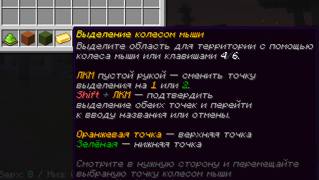
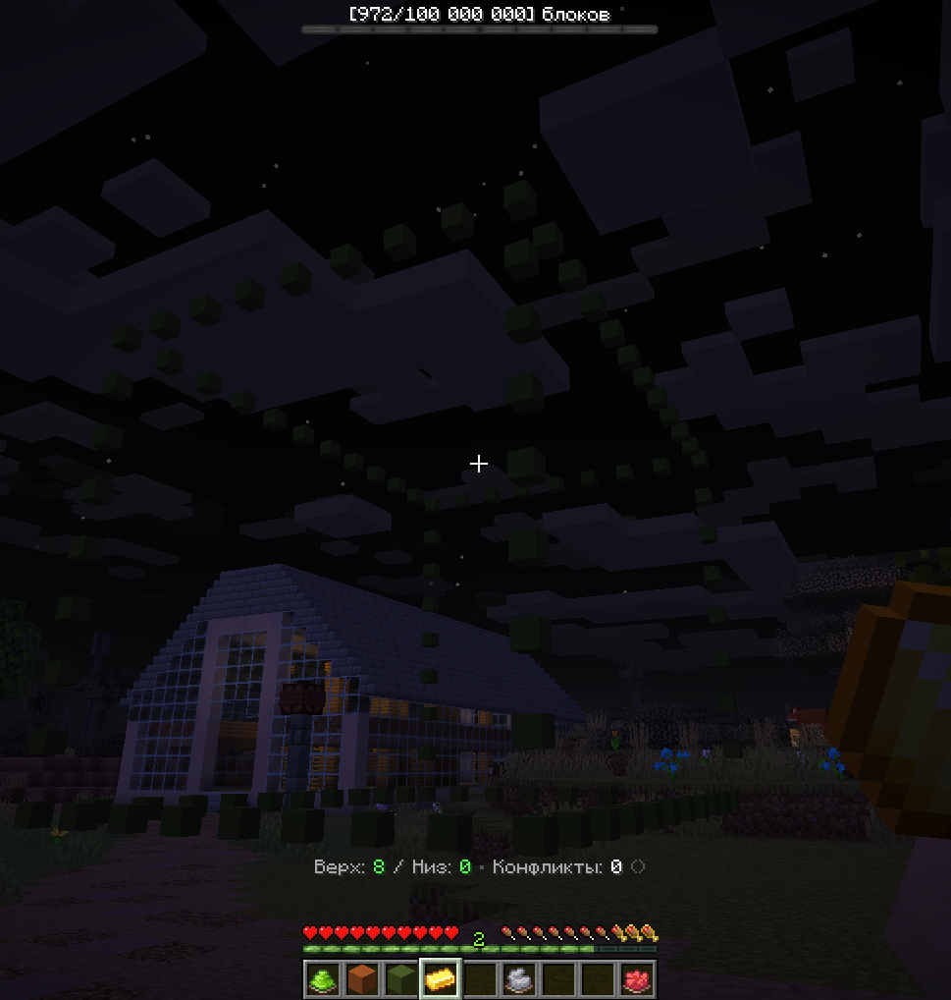
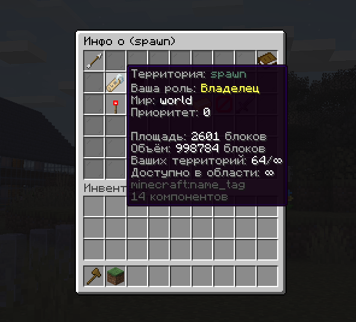

# QQRegions — Вики

> Мощное управление регионами поверх **WorldGuard** для серверов **Paper / Leaf (api 26.2)**.

```
/region ...   /territory ...   /tr ...   /rg ...   /private ...   /zone ...
```

Плагин закрывает весь цикл приватизации на сервере: интерактивное
выделение, создание и удаление регионов, меню флагов, подсветка границ,
управление участниками, рынок продажи/аренды, магазин флагов и
расширений, клановые рейды — и всю локализацию в одном файле.

---

## Оглавление

- [1. Требования и установка](#1-требования-и-установка)
- [2. Быстрый старт](#2-быстрый-старт)
- [3. Команды](#3-команды)
- [4. Права (permissions)](#4-права-permissions)
- [5. Заполнители](#5-заполнители)
- [6. Меню](#6-меню)
- [7. Конфигурация](#7-конфигурация)
- [8. Продвинутая настройка](#8-продвинутая-настройка)
- [9. FAQ и решение проблем](#9-faq-и-решение-проблем)
- [10. Карта скриншотов](#10-карта-скриншотов)
- [11. Карта GIF-анимаций](#11-карта-gif-анимаций)

---

## 1. Требования и установка

### 1.1 Требования

| Зависимость | Тип | Зачем |
|---|---|---|
| [WorldGuard](https://dev.bukkit.org/projects/worldguard) | **обязательная** | ядро регионов |
| Vault + плагин экономики (EssentialsX, CMI…) | мягкая | рынок и магазин |
| PlaceholderAPI | мягкая | `%qqregions_*%` и любые `%…%` внутри меню |
| JustTeams | мягкая | рейды кланов |
| LuckPerms | мягкая | шаблоны прав выделения |
| WorldGuardExtraFlagsPlus | мягкая | доп. флаги / заполнители |

Плагин работает без мягких зависимостей: недоступная механика просто
отвечает игроку соответствующим сообщением из `lang.yml`.

### 1.2 Установка

1. Установите **WorldGuard** (обязательно).
2. Положите `QQRegions.jar` в `plugins/`.
3. Перезапустите сервер — создадутся `config.yml`, `lang.yml`,
   `replace.yml`, `shop.yml`, `menus/*.yml` (и `data.yml` при первом
   действии).
4. Настройте плагин и выполните `/region reload`.

### 1.3 Первый запуск

После первого запуска в папке плагина:

| Файл | Назначение |
|---|---|
| `config.yml` | все настройки плагина |
| `lang.yml` | все тексты для игрока/админа/консоли (один язык плагина) |
| `replace.yml` | перевод «голых» значений флагов (yes/no, allow/deny) |
| `shop.yml` | магазин: цены флагов, пакеты «+площадь», «+регион» |
| `data.yml` | покупки игроков, оферты, аренды (создаётся автоматически) |
| `menus/*.yml` | все GUI: info, flags, players, market, flagshop, blocks, myflags, help |

### 1.4 Алиасы

Имя команды и алиасы задаются в `config.yml`:

```yaml
command:
  name: "region"
  aliases:
    - "territory"
    - "tr"
    - "rg"
    - "private"
    - "zone"
```

Алиасы подхватываются при `/region reload` без перезапуска сервера.
Везде ниже под `/region` подразумевается любой алиас.

---

## 2. Быстрый старт

### Шаг 1. Выделение

```text
/region select
```

Игроку выдаются кнопки в хотбар: **«Создать регион»**, **«Точка 1»**,
**«Точка 2»**, **«Выделить область»**, **«Сброс выделения»**, **«Отмена»**.
Слоты кнопок настраиваются в `config.yml` (`interactive.buttons.<id>.slot`).
Сессия сохраняет инвентарь игрока и возвращает его при выходе.



- **ЛКМ / ПКМ** кнопкой в руке — выполнить действие кнопки (и в воздухе,
  и по блоку);
- **кнопка «Точка 1/2»** — быстрая установка точки по прицелу (до 300
  блоков), иначе на позиции игрока;
- **ЛКМ / ПКМ** пустой рукой — сменить активную точку (1 или 2);
- **колесо или клавиши 4/6** — двигать точку (в select-режиме выбранный
  слот всегда удерживается по центру — `interactive.select-center-slot`,
  поэтому клавиатурные переключения слота работают как колесо);
- **Шифт + колесо** — движение ×`wheel-shift-speed`;
- **Шифт + ЛКМ** — подтвердить выделение.

Во время сессии блокируются команды из `interactive.blocked-commands`
(по умолчанию `ah`, `sell`, `shop`, `baltop`) — защита от «выброса»
кнопок через аукцион/магазины.

Имена и описания кнопок, панелей и любых предметов поддерживают
**MiniMessage**: градиенты (`<gradient:#55ffff:#ff55ff>`), `<rainbow>`,
`<color:#RRGGBB>`; голый `#RRGGBB` прямо в тексте тоже красится.

### Шаг 2. Создание региона

```text
/region create <название>
```

После подтверждения выделения плагин попросит ввести название в чат
(`cancel` — отмена, выделение сохранится). Название проверяется:

- по `region-name.regex` (по умолчанию `[A-Za-zА-Яа-я0-9_-]{3,32}`);
- на запрещённые регионы из `restrictions.banned-regions`;
- на лимит `regions.max-regions` + купленные пакеты «+регион».


### Шаг 3. Флаги и участники

```text
/region flags <регион>     — меню флагов (ЛКМ — вкл/выкл/по умолчанию, ПКМ — группа)
/region add <ник> <регион> — выдать участнику
/region add owner <ник> <регион>
```

Флаг игроку показывается только при праве `qqregions.flags.<флаг>`
(админ видит всё). Купленный в магазине флаг показывается владельцу без
права.

### Шаг 4. Подсветка границ

```text
/region visible <регион> [particles|blocks|territory]
/region visible off        — скрыть все подсветки
```

Подсветку можно привязать к региону флагом `territory-visible` (в меню
флагов): при входе игрока в регион границы подсвечиваются сами и гаснут
через `highlight.region-hide-seconds`. Таймаут региона независим от
выделений (`interactive.view-hide-after`). Свои регионы (владелец/участник)
в радиусе `highlight.auto-show-radius` подсвечиваются точно так же —
**только** при флаге `territory-visible: allow`.



### Шаг 5. Рынок и магазин

```text
/region market                — меню рынка
/region market flags          — магазин флагов
/region market blocks         — расширения (площадь, «+регион»)
/region sell <сумма> [регион] — выставить регион на продажу (публичное объявление)
/region rent <сумма> <время> [регион] — сдать в аренду (публичное объявление)
/region buy [регион]          — купить регион из публичного объявления
/region tenant [регион]       — арендовать из публичного объявления
```

---

## 3. Команды

Полный список доступен и в игре: `/region help` (текстовый вывод) или
кнопка **«Помощь»** в меню (все шаблоны).

### 3.1 Выделение

| Команда | Описание |
|---|---|
| `/region select` | Интерактивный режим (кнопки в хотбаре) |
| `/region select pos <1\|2>` | Установить точку по позиции игрока |
| `/region select point <1\|2>` | Синоним `pos` |
| `/region select max` | Максимально разрешённая шаблоном область вокруг игрока |
| `/region select chunk [N]` | Выделить область из N чанков (по умолчанию — лимит шаблона) |
| `/region select expand [сторона] <N>` | Расширить на N блоков (или `-N` — сузить) |
| `/region select outset <N> [h\|v]` | Расширить во все стороны (h — горизонтально, v — вертикально) |
| `/region select view <ник>` | Посмотреть выделение другого игрока |

**Стороны** `expand`: `north`, `south`, `east`, `west`, `up`, `down`.

Результат командных выделений можно видеть: статус-бар в конце `select`,
плюс подсветка `interactive.command-selection-view` и авто-скрытие
`command-selection-hide-after`.

### 3.2 Регионы

| Команда | Описание |
|---|---|
| `/region create <имя>` | Создать регион из текущего выделения |
| `/region delete [имя]` | Удалить свой регион (или регион, в котором стоишь) |
| `/region info [имя]` | Открыть информационное меню региона |
| `/region flags [имя]` | Открыть меню флагов региона |
| `/region reload` | Перезагрузить все конфиги (+ алиасы, + язык) |

### 3.3 Участники и владельцы

| Команда | Описание |
|---|---|
| `/region add <ник> [регион]` | Добавить игрока участником |
| `/region add member <ник> [регион]` | То же явно |
| `/region add owner <ник> [регион]` | Добавить во владельцы |
| `/region remove <ник> [регион]` | Убрать участника |
| `/region remove owner <ник> [регион]` | Убрать владельца (нельзя снять последнего) |

### 3.4 Подсветка

| Команда | Описание |
|---|---|
| `/region visible [имя] [тип]` | Показать границы региона |
| `/region visible off` | Скрыть все активные подсветки |
| `/region visible type [тип]` | Тип по умолчанию (без аргумента — показать текущий) |
| `/region visible self on\|off` | Личная подсветка «для себя»: действует только на флаг `territory-visible` (команда и меню показывают всегда) |
| `/region visible true\|allow\|false\|deny [тип] [регион]` | Флаг подсветки региона |
| `/region view [имя] [тип]` | Временно показать границы (без изменения флага) |

**Типы:** `particles`, `blocks` (дисплеи со свечением), `territory`
(контур по рельефу). Для регионов типа `particles`/`blocks` работает
внутренняя сетка `outline.grid` — квадраты на **всех 6 гранях** (верх,
низ и четыре боковые); выделение игрока рисует **только 12 рёбер**
(ровно как раньше, без колец и сетки — см. `outline.rings`/`grid`,
они работают только у подсветки регионов). `territory` + `blocks` —
только забор из указанных блоков.

### 3.5 Рынок (Vault)

| Команда | Описание |
|---|---|
| `/region market` | Меню рынка: список объявлений, поиск, сортировка |
| `/region market flags` | Магазин флагов |
| `/region market blocks` | Расширения: пакеты площади и «+регион» |
| `/region sell <сумма> [регион]` | Выставить регион на продажу — **публичное объявление** (любой купит мгновенно) |
| `/region sell <ник> <сумма> [регион]` | Предложить покупку конкретному игроку (приватное предложение) |
| `/region rent <сумма> <время> [регион]` | Сдать регион в аренду — **публичное объявление** (любой арендует мгновенно) |
| `/region rent <ник> <сумма> <время> [регион]` | Предложить аренду конкретному игроку |
| `/region rent dur <минуты> [регион]` | Срок действия объявления аренды (по умолчанию — `market.list-duration-minutes`) |
| `/region buy [регион]` | Купить регион из публичного объявления |
| `/region tenant [регион]` | Арендовать регион из публичного объявления |
| `/region sell\|rent\|buy\|tenant accept\|decline\|cancel <id>` | Принять/отклонить/отменить предложение или объявление |
| `/region market myflags` | Меню купленных флагов |

**Время аренды:** `30` (минут), `2h` (часов), `7d` (дней), `1w` (недель),
`1m` (месяцев), `1y` (лет). По умолчанию — 1 неделя.

**Публичные объявления** принимаются любым игроком, кроме продавца/владельца.
Если автовозврат включён (`market.rent.auto-rent`, кнопка автовозврата в
меню рынка), по окончании аренды объявление снова появляется на рынке
на срок `list-duration-minutes`.

### 3.6 Рейды кланов (JustTeams)

| Команда | Описание |
|---|---|
| `/region raid [регион]` | Запустить рейд (кнопка «Рейд» в меню info подходит только посторонним) |

---

## 4. Права (permissions)

Базовые права выдаются всем автоматически; служебные и `bypass` —
только операторам.

| Право | По умолчанию | Описание |
|---|---|---|
| `qqregions.use` | `true` | Базовый доступ к командам |
| `qqregions.create` | `true` | Создание регионов |
| `qqregions.delete` | `true` | Удаление регионов |
| `qqregions.select` | `true` | Выделение |
| `qqregions.info` | `true` | Информация о регионе |
| `qqregions.manage` | `true` | Управление участниками/владельцами |
| `qqregions.flags` | `true` | Меню флагов |
| `qqregions.visible` | `true` | Подсветка границ |
| `qqregions.market` | `true` | Рынок (sell/rent/buy/tenant/market) |
| `qqregions.raid` | `true` | Рейды клана (JustTeams) |
| `qqregions.reload` | `op` | Перезагрузка конфигов |
| `qqregions.admin` | `op` | Полный доступ, включая чужие регионы |
| `qqregions.bypass.selection-limits` | `op` | Игнор `max-blocks`/`min-blocks` шаблонов |
| `qqregions.bypass.disabled-worlds` | `op` | Работа в мирах из `disabled-worlds` |
| `qqregions.bypass.banned-regions` | `op` | Работа с `banned-regions` |

`qqregions.admin` включает: `reload`, `create`, `delete`, `select`,
`info`, `manage`, `flags`, `visible`, `market`, `raid`.

Дополнительно для меню флагов используется динамическое право
**`qqregions.flags.<флаг>`** (например `qqregions.flags.pvp`):
показывает флаг в меню и разрешает его менять. Право `qqregions.admin`
видит/меняет все флаги.

> Примечание: пары `bypass.*` и `admin` полезно выдавать в LuckPerms
> конкретным группам (см. раздел о шаблонах).

---

## 5. Заполнители

Плагин поддерживает два вида заполнителей:

1. **Внутренние** — `{имя}` — подставляются плагином в `lang.yml`,
   `menus/*.yml`, текстах `config.yml` и raid-уведомлениях.
2. **Внешние PAPI** — `%qqregions_*%` — из собственного расширения
   QQRegions, а также любые общедоступные (например `%vault_eco_balance%`).

### 5.1 Общие для меню

`{region}` `{world}` `{player}` `{role}` `{page}` `{pages}`

### 5.2 По контексту

| Контекст | Заполнители |
|---|---|
| Меню info | `{owners}` `{members}` `{type}` `{area}` `{volume}` `{priority}` `{status}` `{my-regions}` `{max-regions}` `{max-blocks}` |
| Меню флагов | `{flag}` `{flag-name}` `{flag-value}` `{flag-value-label}` `{flag-raw}` `{group}` `{group-label}` `{groups-list}` `{flag-group}` `{flag-group-label}` `{flag-with-group}` `{next-state}` |
| Меню игроков | `{player}` `{role}` `{role-ru}` `{player-id}` |
| Меню рынка | `{market-type}` `{market-region}` `{market-world}` `{market-price}` `{market-who}` `{market-owner}` `{market-status}` |
| Голограмма рынка (market-holo) | `{owner}` (ник продавца/владельца) `{price}` `{nick}` `{time}` `{region}` |
| Магазин флагов | `{flag-name}` `{flag}` `{price}` |
| Магазин расширений | `{pack-name}` `{pack-amount}` `{price}` |
| Боссбар выделения | `{current}` `{max}` `{percent}` `{player}` `{value-color}` |
| Доп. инфо-экшнбар | `{height-top}` `{height-bottom}` `{conflict}` `{conflict-regions}` `{conflict-count}` `{current}` `{max}` `{percent}` `{player}` |
| Рейд (бары/уведомления) | `{region}` `{world}` `{clan}` `{count}` `{total}` `{thief}` `{time}` `{percent}` `{player}` |

### 5.3 Внешние PAPI-заполнители `%qqregions_*%`

Расширение регистрируется автоматически, если установлен
PlaceholderAPI.

**Выделение**

| Заполнитель | Значение |
|---|---|
| `%qqregions_selection_active%` | `yes`/`no` — есть ли выделение |
| `%qqregions_selection_blocks%` | блоков в выделении |
| `%qqregions_selection_max_blocks%` | лимит по шаблону (или ∞ при bypass) |
| `%qqregions_selection_min_blocks%` | минимальный размер |
| `%qqregions_selection_chunks%` | лимит чанков по шаблону |
| `%qqregions_selection_percent%` | процент от лимита (0–100) |
| `%qqregions_selection_over_limit%` | `yes`/`no` |
| `%qqregions_selection_below_min%` | `yes`/`no` |
| `%qqregions_selection_conflict%` | `yes`/`no` — пересекает чужие регионы |
| `%qqregions_selection_conflict_count%` | число чужих регионов |
| `%qqregions_selection_conflict_regions%` | их id через запятую |
| `%qqregions_selection_height_top%` | блоков до верхней границы |
| `%qqregions_selection_height_bottom%` | блоков до нижней границы |

**Регионы и экономика**

| Заполнитель | Значение |
|---|---|
| `%qqregions_region_current%` | id региона, в котором стоит игрок |
| `%qqregions_region_price_<мир:регион>%` | цена активной оферты (`0`, если нет) |
| `%qqregions_region_for_sale_<мир:регион>%` | `yes`/`no` — продаётся |
| `%qqregions_region_for_rent_<мир:регион>%` | `yes`/`no` — сдаётся |
| `%qqregions_region_owner_<мир:регион>%` | владелец региона |
| `%qqregions_eco_balance%` | отформатированный баланс |
| `%qqregions_eco_balance_raw%` | «сырой» баланс |
| `%qqregions_eco_has_<сумма>%` | `yes`/`no` — хватает ли средств |
| `%qqregions_market_listings%` | число активных предложений |

**Рейды**

| Заполнитель | Значение |
|---|---|
| `%qqregions_raid_active%` | `yes`/`no` — идёт ли рейд |
| `%qqregions_raid_state%` | `idle` / `capturing` / `thief` / `cooldown` |
| `%qqregions_raid_region%` / `%qqregions_raid_world%` | регион и мир рейда |
| `%qqregions_raid_clan%` / `%qqregions_raid_thief%` | клан и «вор» |
| `%qqregions_raid_count%` / `%qqregions_raid_players%` / `%qqregions_raid_total%` | число нападающих |
| `%qqregions_raid_remaining%` / `%qqregions_raid_time%` | секунд до конца фазы |
| `%qqregions_raid_cooldown%` | секунд кулдауна региона |

> Любые сторонние `%…%` можно вписывать в тексты меню — они резолвятся
> на конкретного игрока (пример с балансом каждого игрока — в
> `menus/players.yml`). В меню владельца кнопки игрока-владельца
> резолвятся по конкретному игроку, а не по открывшему меню.

---

## 6. Меню

GUI собираются из `menus/*.yml`. Для каждого меню можно задавать
несколько **шаблонов** по роли игрока (`role-required`) и приоритету:

| Роль | Кому подходит |
|---|---|
| `owner` | владелец региона |
| `member` | участник региона |
| `other` | посторонний |
| (пусто) | любой |

Для шаблона задаются: заголовок, размер, fill-панели, статичные кнопки
(с `lore`, командой клика, опциональным `permission` и `tooltip: false`
— скрыть всплывающее окно наведения у конкретной кнопки; у `fill` ключ
`tooltip: false` скрывает окно от фона), динамические
слоты и пагинация. Динамические кнопки собираются в код (флаги из
WorldGuard, игроки из региона, оферты рынка, покупки) и раскладываются
по `slots`/`menu-slots`.

**Псевдокоманды кнопок:**

| Псевдокоманда | Действие |
|---|---|
| `@page:prev` / `@page:next` | листать страницы |
| `@menu:<имя>` | открыть другое меню (info, flags, players, market, flagshop, blocks, myflags, help) |
| `@back` | вернуться в предыдущее меню |
| `@teleport` | телепорт в центр региона |
| `@highlight` | подсветить границы региона |
| `@flag:<имя>:<allow\|deny\|default>` | переключить флаг (`default` = снять, как `/rg flag -r`) |
| `@flag-search` / `@market-search` | поиск по флагам / по рынку |
| `@sort` | сменить сортировку рынка |
| `@add:owner` / `@add:member` | добавить игрока (ввод ника в чат) |
| `@player-del:<uuid>\|ник>:owner\|member` | удалить игрока |
| `@pf:all\|owners\|members` | фильтр списка игроков |
| `@raid:start` | запустить рейд |
| `@region-info-or-pick` | «Моя территория»: в регионе — info, иначе — выбор территории |
| `@region-delete` | подтверждённое удаление территории (WG) |
| `@ps-toggle` | смена группы добавления (владелец/участник) в поиске игроков |
| `@rpsort` | цикл сортировки выбора территории |
| `@rinfo:<мир>:<регион>` | открыть info по конкретному региону |
| `@menu:help` | открыть справку |
| `asConsole!<команда>` / `asPlayer!<команда>` | выполнить от консоли / игрока |
| `close` | закрыть меню |

### 6.1 Меню информации о регионе

Открывается `/region info`. Слитые инфо-кнопки: **Регион** (мир, тип,
статус, площадь, объём, приоритет, роль + у владельца/участника лимиты
игрока `{my-regions}/{max-regions}` и `{max-blocks}`; `∞` при отсутствии
лимита/праве админа) и **Игроки** (владельцы + участники). У владельца
ряд кнопок: **Флаги**, **Игроки**, **Телепорт**
(право `qqregions.admin`), **Подсветка**, **Рынок**, **Удалить**
(переход в меню подтверждения), и **Рейд** — только у постороннего
(`role-required: other`, право `qqregions.raid`), с лором клана
`{raid-clan}` `{raid-balance}` `{raid-online}/{raid-total}`
`{raid-in-region}/{raid-needed}`. При `raid.enabled: false` рейд-кнопка
скрыта полностью.



### 6.1а Подтверждение удаления

Открывается кнопкой «Удалить территорию» из info-меню владельца.
**Да, удалить** (`@menu:confirmdelete` → `@region-delete`, удаляет регион
через WG) / **Отмена** (`@back` — возврат в info).

### 6.1б Меню выбора территории

Кнопка «Моя территория» в главном меню: если игрок внутри региона —
сразу info; иначе — выбор из всех регионов всех миров. У каждого
региона лор (мир/тип/количество игроков/расстояние), клик — info.
Сортировка `@rpsort` циклирует: близкие → дальние → A-Z → Z-A → по
людям.

### 6.2 Меню флагов

Открывается `/region flags`. Динамические кнопки — по флагам WorldGuard
(без тех, что в `ignore-flags`). Названия берутся из `config.yml`
(`flags-names`), значения — из `replace.yml`. ЛКМ — цикл значений:
вкл → выкл → **по умолчанию** (снять, работает дефолт WorldGuard, как
`/rg flag -r`) → вкл; ПКМ — сменить **группу**
(all/members/owners/nonmembers/nonowners). При показе флага без своего
значения кнопка показывает «не задано» и 3-й клик снимает флаг.


### 6.3 Меню игроков

Динамические кнопки — владельцы (DIAMOND) и участники (GOLD_INGOT).
Кнопки **+ Владелец / + Участник**, фильтры «Удалить участников /
удалить владельцев», **Добавить игроков** (открывает меню поиска
игроков). Управление — только владельцы и админы.

### 6.3а Меню поиска игроков

Кнопка «Добавить игроков» в меню игроков. Все игроки сервера: онлайн
первыми, затем оффлайн, без себя; головы со скинами игроков.
ЛКМ — добавить в выбранную группу, ПКМ — убрать, Шифт+ЛКМ — сменить
группу (владелец ↔ участник). Кнопка `@ps-toggle` (слот 4) переключает
группу добавления. Последнего владельца снять нельзя.


### 6.4 Меню рынка

Список активных предложений (поиск, сортировка: название → цена →
по умолчанию). Кнопки: **Расширение**, **Магазин флагов**,
**Мои флаги**, **Помощь**. У каждого объявления:

- **своё** — ЛКМ «автовозврат» (для аренды) / отмена, ПКМ — отмена;
  у своих публичных аренд дополнительно кнопка **срок объявления**
  (`rent dur`);
- **чужое** — ЛКМ — мгновенно купить/арендовать (публичное) или
  принять (приватное предложение).


### 6.5 Магазин флагов

Продаваемые флаги (все, кроме `flags-menu.whitelist` и
`flags-menu.shop-ignore`) с ценами из `shop.yml`. Поиск — по имени или
переводу.


### 6.6 Магазин расширений

Пакеты **«+площадь»** (увеличивают `max-blocks`, один раз) и
**«+регион»** (увеличивают лимит регионов, повторяемые).


### 6.7 Мои флаги

Только купленные игроком флаги. Открытие без покупок отвечает
сообщением (в `lang.yml` → `shop.none-owned`).


### 6.8 Меню помощи

Статичные кнопки с командами плагина по разделам (шаблоны `default` и
`compact`).


---

## 7. Конфигурация

### 7.1 config.yml

Основные секции:

| Секция | Что настраивает |
|---|---|
| `command` | имя и алиасы команды |
| `restrictions` | `disabled-worlds`, `banned-regions` |
| `region-name` | `regex` валидации и принудительный нижний регистр |
| `selection-templates` | шаблоны прав выделения (см. раздел 8.1) |
| `interactive` | интерактивный select: скорость колеса, кнопки (материал + слот в хотбаре), центр-select-слота, запрещённые команды, `sync-worldedit`, view-режим и авто-скрытие |
| `highlight` | подсветка регионов: тип, `region-hide-seconds` (таймаут авто-исчезновения контура региона, независим от выделений; старые `auto-hide-seconds`/`show-seconds` — fallback), кулдаун, `hide-on-exit`/`show-on-exit`, `auto-show-radius` (свои/чужие — только по флагу `territory-visible`), `territory` (забор + `ignore-blocks`), `particles` |
| `outline` | общий пунктир контура: `max-gap` (шаг точек любой линии, напр. 5), `max-points`, `rings` (кольца по высоте), `grid` (квадраты на всех 6 гранях — только для регионов; выделение игрока: 12 рёбер по старому виду) |
| `particles` | частицы выделения |
| `bossbar` / `select-status` | статус выделения: боссбар/экшнбар, тексты `normal/full/conflict`, доп. инфо (`info.text`) |
| `guard` | защита от лагов/пинга |
| `regions` | `max-regions` лимит (0 = без лимита) |
| `flags-menu` | `whitelist` (бесплатные флаги) и `shop-ignore` (не продаются) |
| `flags-names` | пользовательские названия флагов |
| `menu-update` | автообновление меню: `ticks` (глобальный интервал перерисовки открытых меню, по умолчанию 20) и `debounce-after-click` (анти-автокликер, ПО УМОЛЧАНИЮ ВЫКЛ: при true клик по кнопке откладывает перерисовку на `update_interval` меню) |
| `market` | рынок: `enabled`, `multiowner` (single/split), `commission` (% сервера), `offer-timeout-minutes` (срок приватного предложения) и `offer-timeout-action` (RELIST — выставить публично / CANCEL — снять), экономика (символ/группировка), аренда (`grant`, `charge`, `period-minutes`, `list-duration-minutes`, `auto-rent`), голограмма-вывеска (`market-holo` — ОДНА плавающая голограмма у периметра, «облетает» регион за игроком и всегда смотрит на него) |
| `raid` | рейды: фазы, чардж, display, notify |

Пример подсветки (контур + территория):

```yaml
highlight:
  type: PARTICLES            # PARTICLES | BLOCKS | TERRITORY
  region-hide-seconds: 60    # таймаут авто-исчезновения контура РЕГИОНА
  territory:
    ignore-blocks:           # блоки, которые TERRITORY считает пустотой
      - BROWN_MUSHROOM
      - RED_MUSHROOM
      - TALL_GRASS
      - SHORT_GRASS
    fence:                   # «забор» (territory.display: BLOCKS)
      material: OAK_PLANKS
      height: 1.0
      width: 0.3
      thickness: 0.3
      spacing: 1.0
      offset: 0.0
      glow: true

outline:                     # общий пунктир (выделение + регионы)
  max-gap: 5                 # шаг точек любой линии (не больше 5 блоков)
  max-points: 3000           # потолок точек контура
  rings:
    enabled: true
    step: 8                  # кольцо каждые 8 блоков по высоте
  grid:                      # квадраты на верхе/низу — ТОЛЬКО для регионов
    enabled: true
    step: 25
```

### 7.2 shop.yml

```yaml
enabled: true
economy-enabled: true

flags:
  default-price: 1000
  prices:
    pvp: 500
    build: 800
    entry: 600

area-packs:
  big:
    name: "Большая территория"
    blocks: 20000
    price: 5000

region-packs:
  extra1:
    name: "+1 регион"
    amount: 1
    price: 1000
```

### 7.3 replace.yml

Замена сырых значений флагов WorldGuard / WGEFP на читаемый текст:

```yaml
'%worldguard_region_has_flag_pvp%':
  - placeholder: 'yes'
    replacement: 'включено'
  - placeholder: 'no'
    replacement: '&7выключено'
  - placeholder: 'ELSE'
    replacement: ''

flag-groups:
  - placeholder: 'all'
    replacement: 'все'
  - placeholder: 'ELSE'
    replacement: '{value}'

flag-values:
  - placeholder: 'allow'
    replacement: '&aвключено'
  - placeholder: 'deny'
    replacement: '&cвыключено'
  - placeholder: 'ELSE'
    replacement: '{value}'
```

`{value}` в `replacement` подставляет исходное значение.

### 7.4 lang.yml

Все тексты игроку. Доступны `&`-цвета, `&#RRGGBB`, голый `#RRGGBB` прямо
в тексте и заполнители `{имя}`. Дополнительно поддерживается
**MiniMessage**: градиенты (`<gradient:#55ffff:#ff55ff>`), `<rainbow>`,
`<color:#RRGGBB>`, `<hover:...>`, `<click:...>` и пр. — в любых именах и
описаниях предметов и в сообщениях. Строки с мини-разметкой парсятся
MiniMessage (legacy `&`-коды в них переводятся автоматически), битые
мини-строки не роняют и откатываются на обычный legacy-разбор.
Спец-префикс **`actionbar:N!`** в начале перевода отправляет текст в
экшнбар на N секунд (с обновлением, без префикса плагина):

```yaml
prefix: "&8[&bQQRegions&8] "

guard:
  blocked: "actionbar:3!&cСервер нагружен — подождите."
```

### 7.5 data.yml

Автоматическая; не редактируйте на лету:

```text
players.<UUID>.flags       — купленные флаги
players.<UUID>.area-packs  — пакеты площади
players.<UUID>.region-packs.<id> — количество «+регион»
offers.*                   — оферты рынка и аренды
```

### 7.6 menus/*.yml

Раскладки GUI. Правки кнопок/текстов/слотов применяются при
`/region reload`. Слоты футера (45–53) у меню не пересекаются с
`menu-slots` (10–43), так что дубли кнопок невозможны.

У каждого меню есть `update_interval` (тики) — как часто перерисовывается
открытое меню (lore/цены/флаги обновляются на лету); `0` = выключить
автообновление этого меню. Глобальный дефолт — `menu-update.ticks` в
config.yml. Клики по кнопкам перерисовывают меню сразу; опциональный
анти-автокликер `menu-update.debounce-after-click: true` (по умолчанию
выключен) откладывает перерисовку открытого меню после клика на
`update_interval` тиков — навигация и действия кнопок при этом мгновенные.
Подробности — в `menus/MENU_EDITOR.md` §8.

---

## 8. Продвинутая настройка

### 8.1 Шаблоны прав выделения

Для игрока выбирается шаблон с наибольшим `priority`, у которого
совпадает `permission` **или** `placeholder`:

```yaml
selection-templates:
  default:
    permission: ""            # пусто = не проверять
    placeholder: ""           # "%plasma_skill_power%>=60" или "true"/"false"
    priority: 1
    max-blocks: 10000
    min-blocks: 100
    chunks: 16
  vip:
    permission: "luckperms.vip"
    priority: 10
    max-blocks: 50000
    min-blocks: 200
    chunks: 32
```

Механика `placeholder` позволяет выдавать лимиты по любым числовым PAPI
(`>=`, `>`, `<=`, `<`, `==` или просто `true`/`false`).

### 8.2 Защита от лагов (guard)

Клики кнопок меню (и другие механики) отменяются, если сервер нагружен
или пинг игрока высок — защита от «дюпа» предметов при лагах:

```yaml
guard:
  enabled: true
  min-tps: 15.0
  max-ping: 5000
```

### 8.3 Рейды (JustTeams)

```yaml
raid:
  enabled: false
  min-attackers: 2
  online-percent: 50
  capture-time: 60
  thief-time: 60
  cooldown-time: 300
  blacklist: []
  owners-offline-required: true
  abort-on-owner-online: true
  economy:
    enabled: false
    source: CLAN            # PLAYER — с баланса вора (Vault), CLAN — с банка
    percent: 10
  display:
    mode: ACTIONBAR         # BOSSBAR | ACTIONBAR | NONE
    text: "&cЗахват {region}: &f{time}&c сек • нападающих &f{count}&c/&f{total}"
    thief-text: "&2Вор &f{thief}&2: &f{time}&2 сек"
  notify:
    start:
      message: "&8[&cКлан&8] &f{clan} &cнападает на регион &f{region}&7!"
      commands: []
```

Уведомления поддерживают `asConsole!...` и `asPlayer!...` команды с
подстановкой `{заполнителей}`.

### 8.4 Экономика

Формат чисел настраивается в `market.economy`:

```yaml
market:
  economy:
    symbol: "₽"
    symbol-position: AFTER     # AFTER = "1000 ₽", BEFORE = "₽ 1000"
    decimal-places: 0
    grouping: true
    group-separator: ","
    decimal-separator: "."
  rent:
    grant: MEMBER              # MEMBER | OWNER
    charge: PERIOD             # ONCE | PERIOD (периодическое списание)
    period-minutes: 1440
  list-duration-minutes: 10080 # срок публичного объявления аренды (по умолчанию 7 дней)
  auto-rent: true              # автовозврат с автопродлением после конца аренды
  multiowner: single           # single — вся сумма инициатору; split — всем владельцам поровну
  commission:
    enable: false              # комиссия сервера с продажи/аренды
    rate: 0.01                 # доля от суммы (0.01 = 1%, 0.05 = 5%). Списывается с получателя
  offer-timeout-minutes: 60    # срок жизни приватного предложения (0 = без ограничения)
  offer-timeout-action: RELIST # что сделать по истечении: RELIST — выставить публично; CANCEL — снять с рынка
  market-holo:
    enabled: true              # ОДНА голограмма-вывеска у периметра региона на время объявления
    view-distance: 24          # радиус (по X/Z), в котором голограмма ведёт игрока вдоль границы
    y-offset: 1.5              # сдвиг относительно уровня Y ИГРОКА (0 — ровно на Y игрока, 1.5 ≈ лицо)
    scale: 1.0                 # множитель размера текста
    line-width: 200            # макс. длина строки в блоках
```

---

## 9. FAQ и решение проблем

**Меню не открывается / команда отвечает «меню не настроено».**
Проверьте файлы в `menus/` и `/region reload`. Отдельные меню можно
отключить, убрав `dynamic-*` / `purchased-*` секции — плагин тогда
предложит фолбэк.

**Рынок не работает.**
`market.enabled: true` + установленный Vault + плагин экономики.
Без Vault команды отвечают «экономика (Vault) недоступна».

**Магазин флагов пуст.**
Флаги продаются только если они **не** в `flags-menu.whitelist`
(там бесплатные) и не в `flags-menu.shop-ignore`. Пустой `whitelist`
означает «все флаги продаются».

**Купленный флаг не виден в меню.**
Если вы владелец региона — флаг появится без права. Посторонним
купленный флаг не даёт прав на чужие регионы.

**Не вижу точки выделения.**
Проверьте `particles.enabled: true` (или `interactive.view-mode: BLOCKS`)
и не отключён ли мир в `restrictions.disabled-worlds`.

**Подсветка не срабатывает от флага.**
Флаг `territory-visible` должен быть `allow`, и не срабатывает чаще
`highlight.cooldown-seconds`. Для `territory-visible: false` флаг
регистрируется, но вход не подсвечивает (команда `/region visible`
работает). Свои регионы в радиусе `auto-show-radius` тоже светятся
только при флаге `allow` — без флага они не загораются ни рядом, ни
при входе в соседний регион с флагом. Контур гаснет сам через
`highlight.region-hide-seconds` (не зависит от таймаутов выделений).

**Рейд не начинается.**
Проверьте JustTeams (клан у всех нападающих), `min-attackers`,
`online-percent`, черный список, и что владельцы офлайн (если
`owners-offline-required: true`).

---

## 10. Карта скриншотов

Положите скриншоты в папку **`docs/screenshots/`** с именами `01.png`,
`02.png`, … — они уже вставлены в текст вики по номерам.

| № | Файл | Что должно быть на скриншоте | Где вставлен |
|---|---|---|---|
| 01 | `01.png` | Меню информации о регионе (владелец): описание, кнопки Флаги/Игроки/Рынок/Телепорт/Подсветка/Удалить/Помощь | §6.1 |
| 02 | `02.png` | Интерактивное выделение: частицы вокруг области, кнопки в хотбаре (Создать/Выделить/Сброс/Отмена), активная точка | §2 Шаг 1 |
| 03 | `03.png` | Три состояния статуса выделения: норма (white), максимум (red), конфликт (yellow) | §5.2 / боссбар |
| 04 | `04.png` | Запрос названия региона в чате («Введите название региона…») | §2 Шаг 2 |
| 05 | `05.png` | Меню флагов: сетка флагов с иконками, группы, пагинация, поиск `@flag-search` | §6.2 |
| 06 | `06.png` | Меню игроков: алмазы-владельцы, слитки-участники, кнопки «+Владелец/+Участник», фильтры | §6.3 |
| 07 | `07.png` | Подсветка границ региона: рёбра + кольца + сетка (квадраты) или TERRITORY-забор вдоль рельефа | §2 Шаг 4 |
| 08 | `08.png` | Меню рынка: список предложений, поиск, сортировка, кнопки Расширение/Магазин/Мои флаги | §6.4 |
| 09 | `09.png` | Магазин флагов: продаваемые флаги с ценами | §6.5 |
| 10 | `10.png` | Магазин расширений: пакеты «+площадь» и «+регион» с ценами | §6.6 |
| 11 | `11.png` | «Мои флаги»: купленные флаги | §6.7 |
| 12 | `12.png` | Рейд: экшнбар/боссбар «Захват …» или чат-уведомление о начале/срыве | §3.6 / §8.3 |
| 13 | `13.png` | Меню помощи: разделы Выделение/Регионы/Флаги/Подсветка/Рынок/Рейд | §6.8 |

> Совет: для меню делайте кадры при **тёмной** теме интерфейса —
> с `&#000000` заголовками (как в дефолтных `menus/*.yml`) панели и
> иконки смотрятся контрастнее.

---

## 11. Карта GIF-анимаций

Положите GIF-файлы в папку **`docs/gifs/`** с именами `01.gif`, `02.gif`,
… и поменяйте ссылку в тексте ниже. На картинке должно быть видно
**движение** — спокойные скриншоты уже есть в разделе 10.

| № | Файл | Что должен показать GIF | Куда вставить |
|---|---|---|---|
| 01 | `01.gif` | **Перемещение области/точки выделения**: колесо мыши и клавиши 4/6 двигают область по взгляду, выбранный слот хотбара «залипает» в центре, ЛКМ пустой рукой переключает точку 1↔2 | §2 Шаг 1 |
| 02 | `02.gif` | **Создание региона**: подтвердил выделение → ввод названия в чат → контур загорается + `/region visible` | §2 Шаг 2 / Шаг 4 |
| 03 | `03.gif` | **Подсветка по входу и выходу**: вход в регион с флагом `territory-visible` зажигает контур, через `region-hide-seconds` гаснет сам; с `show-on-exit` выход тоже подсвечивает | §2 Шаг 4 |
| 04 | `04.gif` | **TERRITORY-забор по рельефу**: «забор» идёт по верху холма и под сводом пещеры; под кроной дерева ложится на ствол, на стеклянной крыше — по краю земли | §3.4 |
| 05 | `05.gif` | **Рынок**: голограмма-вывеска «облетает» периметр региона и всегда смотрит на игрока; ЛКМ мгновенно покупает/арендует | §6.4 |
| 06 | `06.gif` | **Тултипы в меню**: `tooltip: false` у кнопки — окно наведения не всплывает, у фона из тёмного стекла — тоже; остальные кнопки показывают свои | §6 |
| 07 | `07.gif` | **Рейд**: экшнбар/боссбар «Захват …», фаза вора, срыв по `online-percent` | §8.3 |

> GIF записывайте с помощью OBS/ScreenToGif по 5–8 секунд. Сжимайте до
> ~1–2 МБ (уменьшение FPS до 15 и ширины до 480–640 px). Ставьте курс на
> то, что двигается — иначе в тексте вики просто скриншот.

---